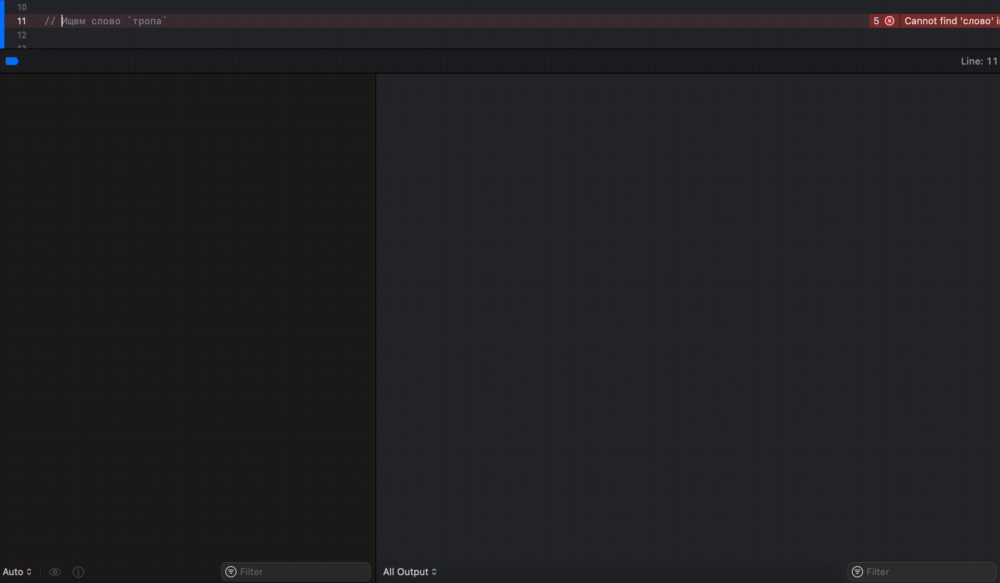

# Программа для выбора слова 

# Команды работы программы

По умолчанию программа работает с словами из 5 букв. Возможно, стоит поправить и поддержать другое количество, но это отдельная задача.

- `/start` - начало или перезапуск работы программы
- `-` - указание символа для слова. Так обозначается символ отсутствия буквы
- `+` - указание символа для слова. Так обозначается символ присутствия буквы, но не на своем месте
- `@` - указание символа для слова. Так обозначается символ буквы на своем месте

# Пример

- При выводе программой слова `трата`, а при искомом `штраф`, маска должна составлять `+++--`

# Алгоритм работы программы

- Программа на вход получает список предопределенных слов из 5 букв
- При вводе команды `/start` или первом запуске, система выбирает слово, в которых все буквы разные
- Пользователь вводит маску, согласно полученному слову
- При вводе маски формируются три правила и порядок фильтрации:
- Буквы нет совсем, она отфильтровывается в следующих словах
- Буква на своем месте, включается в  фильтр, чтобы были все слова удовлетворяющие данному правилу
- Буква есть, но не на своем месте, проверяется ее обязательное наличие в слове
- Удаляем буквы на своих местах и присутствующие буквы из списка букв нет совсем
- Выбираем новое случайное слово для проверки, проверяя что не показывали его раньше
- Если слово одно - выдаем его пользователю
- Если слов нет, пишем что пользователь выиграл и выбрал несуществующее слово

# Ресурсы программы 

- https://bezbukv.ru/mask/*****
- В проекте есть файл с русскими словами, отфильтрованный по количеству букв (5) из сайта выше `russian-5.txt`
- Все русские слова можно взять отсюда https://github.com/danakt/russian-words
